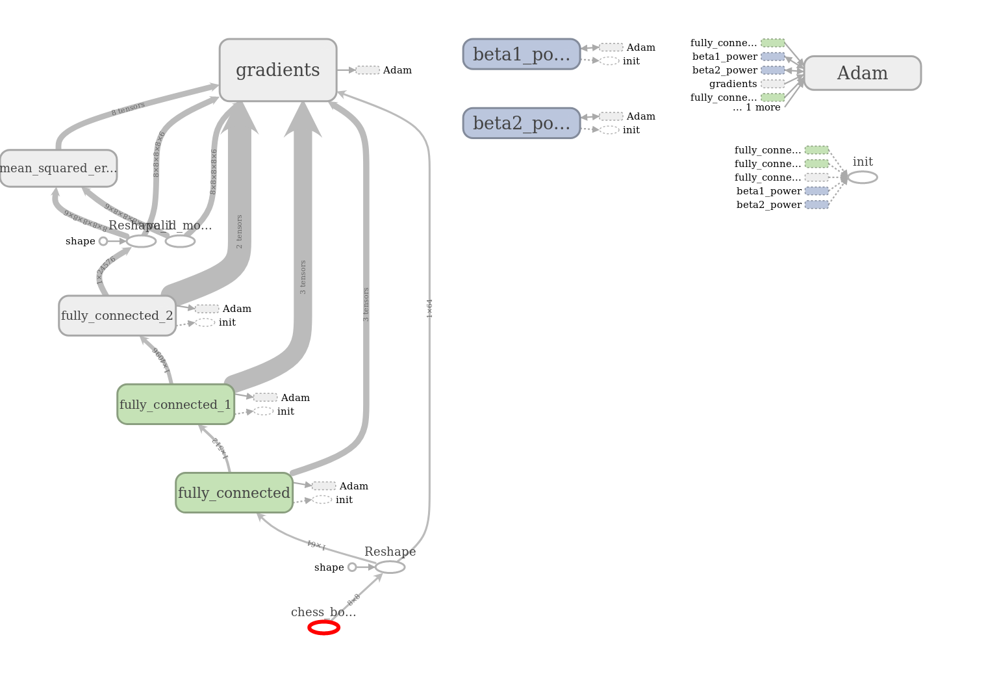
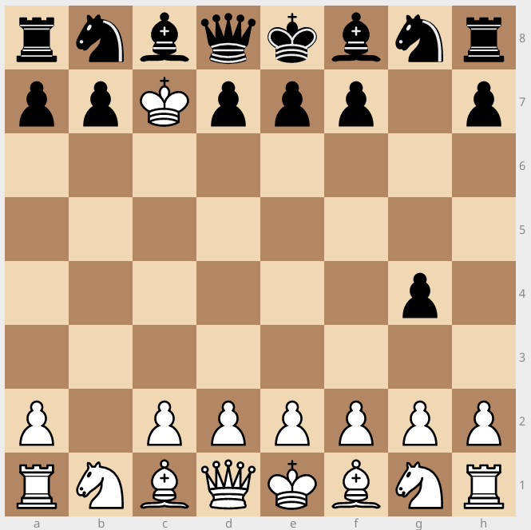
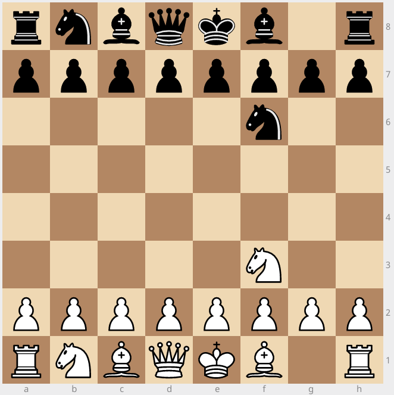
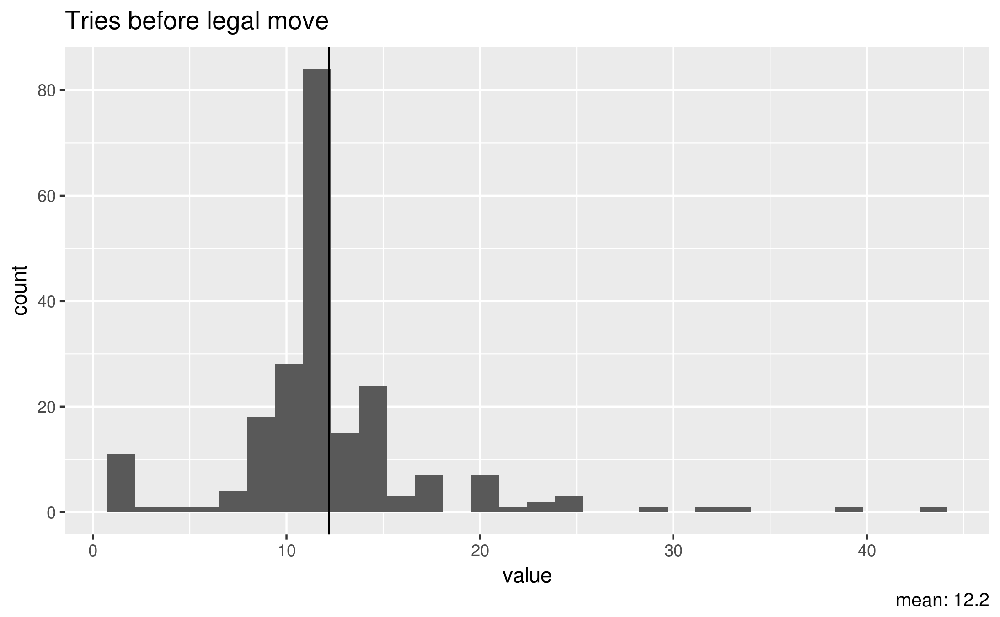
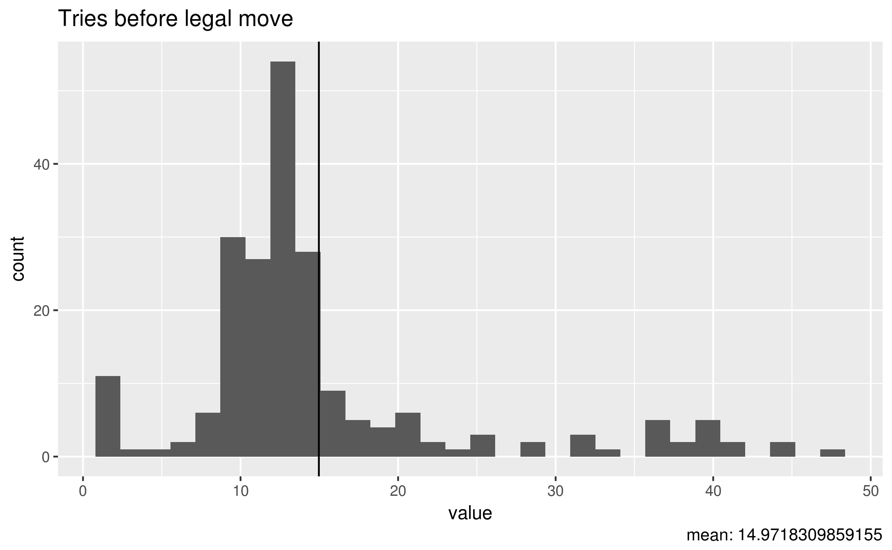
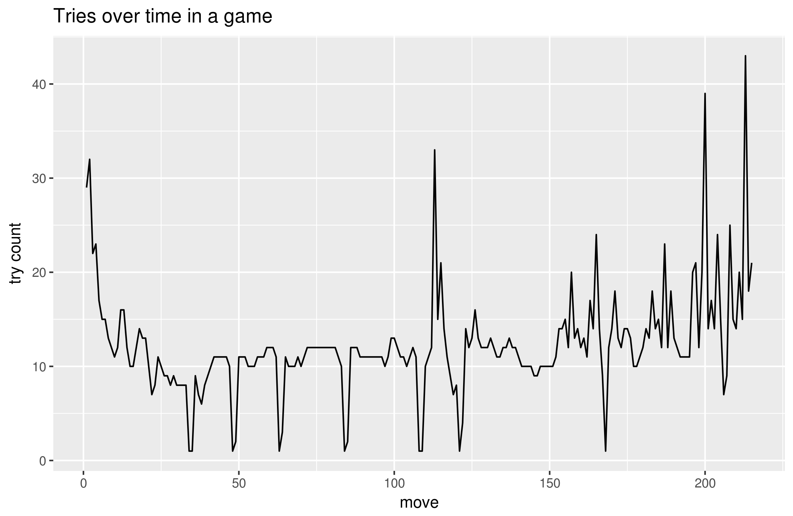

# Chess RL: neural nets learning chess the way we learn chess

Jonathan Dayton - Dec. 19, 2017

## Introduction

I have been interested in deep RL, AI, and chess, and since there was no code published with the recent [AlphaZero paper](https://arxiv.org/pdf/1712.01815.pdf), I thought it would be interesting to make a chess AI that learns by playing against itself.  My initial plan was to:

- Get a chess AI environment running
- Make two AIs play against each other
- Save weights and adjust the fitness metric over time:
  - Initially reward for making valid moves
  - If time, reward for winning games, developing pieces, gaining material, and gaining space

I used TensorFlow to define and run my neural network and the python-chess module to run the actual chess games.  My code is [available on GitHub]().

## Initial plan

My initial approach was to take in the board as a vector of floats, with the following code:

| ID | Piece |
|----|-------|
| 0 | empty space |
| 1 | black pawn |
| 2 | white pawn |
| 3 | black knight |
| 4 | white knight |
| 5 | black bishop |
| 6 | white bishop |
| 7 | black rook |
| 8 | white rook |
| 9 | black queen |
| 10 | white queen |
| 11 | black king |
| 12 | white king |

So the board starts out looking like this:

```txt
[
  [ 7, 3, 5, 9,11, 5, 3, 7],
  [ 1, 1, 1, 1, 1, 1, 1, 1],
  [ 0, 0, 0, 0, 0, 0, 0, 0],
  [ 0, 0, 0, 0, 0, 0, 0, 0],
  [ 0, 0, 0, 0, 0, 0, 0, 0],
  [ 0, 0, 0, 0, 0, 0, 0, 0],
  [ 2, 2, 2, 2, 2, 2, 2, 2],
  [ 8, 4, 6,10,12, 6, 4, 8]
]
```

*Note: although White is traditionally at the bottom of the board, White's pieces start on `board[6:7,:]` in order to simplify display*

The neural network then maps this vector to a vector of moves with probabilities assigned to each possible move.  As the AlphaZero paper alludes to, enumerating all possible moves is complicated (i.e. more complicated than for the game Go) because:

- Different pieces move in different ways
- Pawns can only move in one direction, so the game isn't symmetrical
- Certain moves can be legal or illegal with the same visible board state (e.g. castling depending on whether the king or rook has moved before)
- Pawns have to change to a different piece (but not to a pawn or king) if they reach the 8th / 1st rank.  But other pieces can never change to another type of piece.

So in my project, I defined "all possible moves" as including:

> Any piece (identified by a location on the board) moving to any other location on the board and simultaneously changing to any other piece.

The UCI standard of recording chess moves defines a chess move the following way: f0t0[p] (from-file, from-rank, to-file, to-rank, and an optional "promoted-to piece" character).  For example, if a pawn starting on a7 takes a piece on b8 and is promoted to a knight, the UCI representation of that move would be "a7b8n".  I converted this representation of moves into a 5d matrix (shape: (8, 8, 8, 8, 6,)) for the neural net to fill with per-move probabilities.  I checked the matrix against a matrix with actual valid moves in order to backpropagate through the network and update our weights based on our criterion.

The final dimension in this 5d matrix represents which piece type the piece will be after moving.  The indices represent each piece type in this order: `[Pawn, Knight, Bishop, Rook, Queen, King]`, both for simplicity (the indices in this 0-indexed array represents int(1 - the enumerated types) from the `python-chess` module) and because this is the approximate order of the pieces sorted by value ascending (the exception: Knights and Bishops are usually considered equally valuable).

Since the search space is so large (size 24576) and since moves like pawn promotion, castling, and en passant only happen rarely and are only valid under rare circumstances, I was interested to see whether the players would find these moves with my initial reinforcement criterion or if my learning metrics would need to be altered.

## Training criterion

I bought a Chess for Dummies book from the Deseret Industries, and the person who wrote it teaches a lot of chess to people as young as elementary school children, so I thought that the order in which he presents things to learn is probably a decent way for someone to learn how to play chess.  If I could somehow quantify each of these things, I could get my algorithm to learn in the same way that a human learns.  I read through the table of contents, and here is a rough order of things presented in the book, along with the ways I think I could construct a reward system sequentially for each concept:

- The pieces & valid moves: reward for picking out a valid move
- Space: reward for making moves that expand the number of spaces being attacked by the player's pieces
- Material: reward for gaining a material advantage (taking pieces without losing pieces)
- Development: reward for moving pieces away from their starting position

I was hopeful that by 1. only giving the players knowledge of valid moves, 2. keeping the weights from the more successful of the players, and 3. forcing the players to keep trying new moves until the game was over, the neural net would learn chess by itself without needing more sophisticated reinforcement metrics.  However, since keeping the weights of the winning player was similar to a weak evolutionary model (strong selection, but little variation), I had other metrics planned out in case learning did not occur.

## Converting to and from the `python-chess` module

I used the `python-chess` Python package as a chess engine for this project, which handles all the setup and rules of a chess game.  The module gave piece type and color as enumerated type and allowed for checking individual squares on a board for pieces.  It also provided a list of all valid moves at any point in the game.  Before jumping into making a deep neural net, I first needed to convert the chess board and chess moves into a matrix and indices that a neural network could use as inputs.  I used the test-driven development (TDD) methodology for developing my helper/conversion functions, which greatly simplified the development process and minimized the number of bugs I had to deal with.

For some reason, the most difficult part of working with the `python-chess` module was trying to convert the maximally suggested move from the players (which came in as a 5D array of floats) back into a move that could be recognized by the module.  This difficulty came primarily because the `numpy.argmax` function I used would only return the index of the maximum item in an array as if the array was first flattened (for instance, if a player chose the King's Pawn Opening move `(6, 4, 4, 4, 0)`, `argmax` would return `20184`).  I struggled with this issue conceptually for several long, embarrassing hours before figuring it out.

## Initial Graph Structure

I started with a network with a very simple structure.  One of my main concerns in making a complex graph was that I would likely be training with my laptop CPU and each step was very complex.  So I opted for a series of 3 fully connected (FC) layers, each adding a dimension to the output data.  The first two FCs were followed by ReLU activation functions, and the third FC was followed by a sigmoid activation function in order to map it into the [0, 1] range for comparison with the valid moves matrix.  Mean squared error loss was calculated and minimized by the Adam Optimizer.  The overall idea was that the players could be given a chess board and map it to a set of optimal & legal moves.



## Training Loop

while the game is not done:
  while the given move is invalid:
    the given player tries to make a move
    (loss is determined by the distance between correct moves & output moves)
  make the selected move
  switch players

When the game is finished, the weights of the player who won (or of the Black player in case of a draw, since by virtue of going first White has the advantage) will be copied for both players, and the game will start again.. for N number of games.  A game can finish in multiple ways:

- Black wins with checkmate
- White wins with checkmate
- Stalemate
- Insufficient material
- 75 moves have occurred without a piece being taken or a pawn being moved
- 5 consecutive moves have occurred where each piece only goes back and forth

But what if the players optimize and start to output ALL possible moves equally?  How will we pick from those moves which move to make?

## Training

I began training, and I realized that the game would go on for a few moves and then freeze.  I was a little confused by that, and then I saw it play a game that only lasted two moves: `1. bxc7=K g4 1/2-1/2`.  White's b pawn had leaped across the board, taken Black's c pawn, and transformed itself into a king.  Black responded by pushing its g pawn not one, not two, but three squares forward.  The engine was confused and decided that the game was a draw.  



I clearly had a bug in the part of my code that restricted invalid moves from being played.  Once I fixed that, I ran the code again several times unsuccessfully.  For some reason, White would try 2-3 things before finding a successful move, Black would try 7-9 moves before mirroring White's move, and then White couldn't find another valid move.  Although the loss (MSE, output moves vs valid moves) was measured in the thousandths, something was keeping the correct output from being translated into correct moves.



Upon entering the debugger, I found that White was trying to move Black's pieces after the first move.  I thought that this may have been because White and Black had shared weights and, or it may have been because there was some bug in the way I was passing in possible moves.  From inspecting the variables, it didn't look like I had any bugs--the players were always getting the correct board layout and the correct set of legal moves.  As a sort of last-ditch effort before messing with my graph, I changed the learning rate on my AdamOptimizer from 1.0e-3 to 1.0e-5.  And amazingly enough, it actually worked!  The players played [an entire 108-move game](https://www.chesspastebin.com/2017/12/19/my-ai-itself-by-jonathan-dayton/) (an incredibly boring game, but a game nonetheless) that ended in a draw.  Notably, on move 71, Black was able to successfully promote a pawn to a knight.

## Improvements

On my CPU, this game took about 10 minutes to complete.  I wanted to add some reinforcement for the players to win, but I needed to speed up the process before being able to play multiple games for win optimization.  One major bottleneck I saw was the number of moves tried before a valid one was found.  Occasionally a move would be found in 1 or 2 moves, but most often, 12 or 13 (and occasionally as many as 43) moves would be tried before a legal move was found.  I thought that this may be partly because given just the locations of the pieces on the board, the players don't know whether it's White's or Black's turn to move.  In order to fix this, I simply created a 1D placeholder with a 1.0 or 0.0 depending on whether it was White's or Black's turn and concatenated it to the reshaped chess board tensor.



Unfortunately, this additional information regarding whose turn it was somehow significantly increased the average number of attempts per move (mean before: 12.20, after: 14.97, p=0.0001534).



I then tried increasing the learning rate to 1.0e-4, but after about 20 moves, the try count suddenly increased to 144, and the players were unable to find a valid move.  I thought that the problem may be due to some weights increasing dramatically with the unbounded ReLU activations, so I tried switching my first two activations to tanh functions, but the players once again stopped finding legal moves after about 20 moves.  

At this point, I realized that the players were only ever seeing one game, and in each game, there are many different situations that they have to learn about.  For example, they only see the board in its starting position on time.  They seem to get better with moving the pawns over time (some moves are played without trying illegal moves first), but eventually the pawns run into each other and other pieces have to move, and the try count increases again.  Then towards the endgame when there are few pieces left, the players have to figure out a completely different strategy.  Since the players are never met with a similar board again, it makes sense that they don't ever improve at making moves.



Once I realized this, I set TensorFlow up to save the weights and set it to work on playing several consecutive games while I wrote my report and planned out my next moves.  Unfortunately, I ran out of time to train it as well as I would have liked to, but ultimately I was excited that I was able to make something that was able to play a full game of chess.  Although 12 wrong moves per move is very high, I think it's pretty significantly low considering the size of the search space is nearly 25,000, and I think that with future tweaks to the computation graph, reward system, and parameters, this model could eventually become competitive at chess.

## Future steps

- ~~Output PGNs in order to view the games~~
- Train many generations on the supercomputer / GPU
- Make it work with a clock (real chess is timed)
- Battle other AIs or real people on Chess.com
- Reduce output options - AlphaZero used an 8x8x73 output
- Add reinforcement for winning / predicting an outcome
- Convolutional network (dimensionality reduction?)
- Generating games based on poor performances
- Genetic algorithm
- Add lookahead capabilities (like AlphaZero's Monte Carlo search & StockFish's alpha-beta search)

## Other project

I spent about 6 hours on another project before I settled on the chess project.  I was interested in imputing a full gene set of transcriptomic data from a smaller subset of genes using an autoencoder.  I was able to do this with MNIST data with a high degree of success, but I found that people already are highly successful at this with transcriptomic data using normal statistical methods, and I lost interest in this project after a long semester of biology research.

## Time spent

|                    Activity                    | Time Spent |
|:-----------------------------------------------|-----------:|
| Defining the project                           |    2:17:00 |
| Making a preliminary autoencoder               |    1:00:00 |
| Reading the literature                         |    2:00:00 |
| Design / start writing                         |    3:00:00 |
| Figuring out chess AI environments             |    2:58:26 |
| Planning out matrix representation of moves    |    0:16:36 |
| Converting from python-chess to matrix         |    7:24:52 |
| Setting up initial training loop               |    2:04:56 |
| training, debugging, and analyzing performance |    2:00:00 |
| making performance improvements                |    1:09:22 |
| reading the literature                         |    1:00:47 |
| writing                                        |    1:21:24 |
| Total                                          |   26:33:23 |